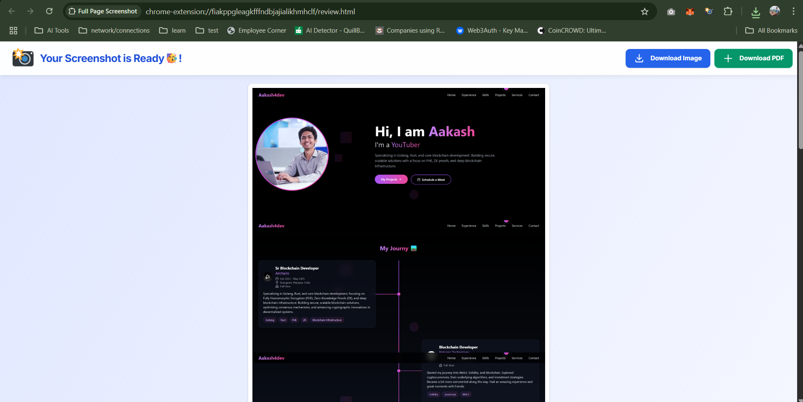

# Full Page Screenshot - Chrome Extension

https://chromewebstore.google.com/detail/full-page-screenshot/demfcmnjgmcoflaoobhjhioiomgecndb

A clean, fast, and reliable Chrome extension to capture a full-page screenshot of any website with a single click. No ads, no bloat, just a perfect screenshot every time.

## ✨ Features

* **One-Click Simplicity:** No complex settings. Just click the button and the capture begins.
* **Truly Full Page:** Our advanced scrolling technology captures everything on the page, including content below the fold.
* **Completely Free & Private:** No ads, no premium features, and no tracking. Your privacy is paramount.
* **Modern & Clean UI:** A beautifully designed interface that is a pleasure to use.
* **Instant Review & Download:** See your full screenshot immediately in a new tab and download it as a high-quality PNG file.

## 🚀 Installation

### 1. Install from the Chrome Web Store (Recommended)

[**Install the Extension from the Chrome Web Store**](https://chrome.google.com/webstore/)

### 2. Install for Development (from source)

If you want to test or contribute to the extension, you can load it from the source code:

1. Clone this repository: `git clone https://github.com/aakash4dev/full-page-screenshot.git`
2. Open Google Chrome and navigate to `chrome://extensions`.
3. Enable **"Developer mode"** with the toggle in the top-right corner.
4. Click the **"Load unpacked"** button.
5. Select the cloned `full-page-screenshot` directory.
6. The extension will now be installed locally!

## 🛠️ How to Use

1. Navigate to the webpage you want to capture.
2. Click the "Full Page Screenshot" icon in your toolbar.
3. Click the "Capture Full Page" button.
4. The extension will automatically scroll and capture the page.
5. Your complete screenshot will open in a new tab, ready to be saved!

## 💻 Tech Stack

* **HTML5**
* **Tailwind CSS** for styling
* **Vanilla JavaScript**
* **Chrome Extension Manifest V3 API**

## 📄 License

This project is licensed under the MIT License. See the [LICENSE.md](LICENSE.md) file for details.

## ✉️ Contact & Feedback

Created with care by **Aakash** ([@aakash4dev](https://twitter.com/aakash4dev)).

If you have any feedback, suggestions, or issues, please [create a GitHub Issue](https://github.com/aakash4dev/full-page-screenshot/issues) in this repository or reach out to me on my social platforms:

* [**Portfolio**](https://www.aakash4dev.com)
* [**Twitter**](https://www.twitter.com/aakash4dev)
* [**LinkedIn**](https://www.linkedin.com/in/aakash4dev)
* [**Medium**](https://medium.com/@aakash4dev)
* [**YouTube**](https://www.youtube.com/@aakash4dev)
* [**GitHub**](https://github.com/aakash4dev)
* [**Email**](mailto:aakash4dev.me@gmail.com)
* [**Privacy Policy**](privacy-policy.html)
* [**Buy Me a Coffee**](https://coff.ee/aakash4dev)
